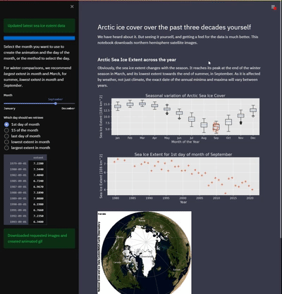

# Create Animated Arctic Sea Ice gif

Use this app to create an animation of arcitc sea ice cover since 1978/1979. Check how much the ice covered area has changed over
time, by looking at annual comparisons of the same months across multiple years.

This app uses [NSIDC Sea Ice Index G02135](https://nsidc.org/data/g02135) data. 

_Fetterer, F., K. Knowles, W. N. Meier, M. Savoie, and A. K. Windnagel. 2017, updated daily._ Sea Ice Index, _Version 3. 
(arctic sea ice extent and arctic sea ice extent blue marble images). Boulder, Colorado USA. NSIDC: National Snow and Ice Data Center. 
[doi: https://doi.org/10.7265/N5K072F8]( https://doi.org/10.7265/N5K072F8)._

## Installation and running

[Launch it on streamlit](https://share.streamlit.io/klausgpaul/ice-cover-movie/ice_cover_movie.py)

[Original idea](https://gitlab.com/KlausGPaul/climate-change)

